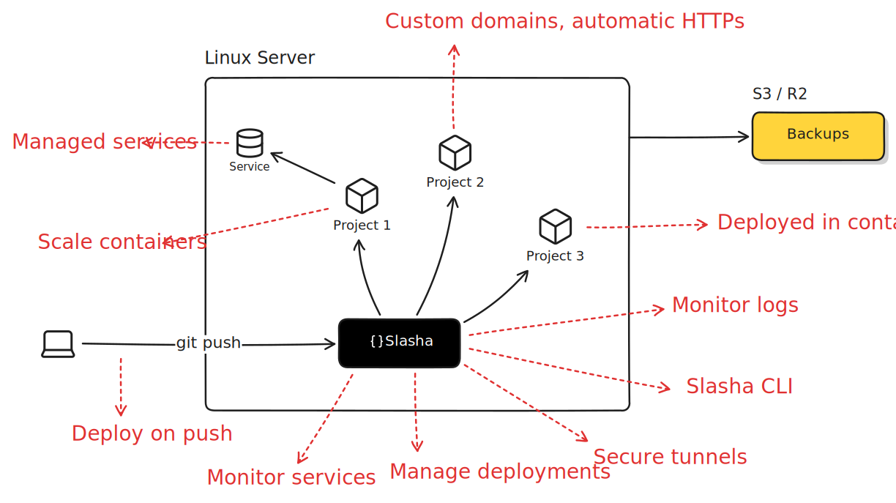

<br />

<p align="center">
  <picture>
    <source media="(prefers-color-scheme: dark)" srcset=".github/banner-dark.svg">
    <source media="(prefers-color-scheme: light)" srcset=".github/banner.svg">
    
  </picture>
</p>

<p align="center">
  Self-hosted platform to deploy your apps with a git push.
</p>

<p align="center">
  <a href="LICENSE"></a>
  <a href="https://slasha.com"></a>
  <a href="https://slasha.com/docs/getting-started/server-setup"></a>
  <a href="https://github.com/slashacom/slasha/actions"></a>
  
</p>
<br />

Slasha is a single binary you install on your server. It turns a plain Linux box into your own
platform-as-a-service: push code with git and Slasha builds it, runs it in a container, routes
traffic to it over HTTPS, and keeps it healthy - no Kubernetes, no YAML, no external control plane.

## Table of contents

- [Features](#features)
- [Requirements](#requirements)
- [Installation](#installation)
- [CLI usage](#cli-usage)
- [Development](#development)
- [Contributing](#contributing)
- [Security](#security)
- [License](#license)

## Features

- Deploy with a plain `git push`, with optional auto-deploy on every push
- Builds your code automatically with [railpack](https://railpack.com) — no Dockerfile required
- Run managed databases: PostgreSQL, MySQL, MongoDB, and Redis
- Automatic HTTPS on custom domains, with TLS issued and renewed for you
- Scale out by running more web or worker processes per app
- Zero-downtime deploys that are health-checked and auto-roll back on failure
- Stream live logs from any deployment or service
- Reach a managed service from your laptop through a secure tunnel, with no open ports
- Keep data on persistent volumes with on-demand and scheduled backups
- Manage apps, services, domains, and logs from the built-in web dashboard or the CLI

<br />




## Requirements

Slasha runs on the server. The setup script installs anything missing, but the host needs to be:

- A 64-bit Linux server
- Running `systemd`
- Reachable on ports `80` and `443` (and `22` for git over SSH)
- Run with root or `sudo`

The setup script installs and configures Docker (with Compose and Buildx), `ufw`, and `sshd` for you.
A domain you control, pointed at the server, is needed for HTTPS and the dashboard.

The CLI runs on your own machine (Linux, macOS, or Windows) and talks to your server over HTTPS.

## Installation

Run the setup script on a fresh server:

```bash
curl -fsSL https://slasha.com/setup.sh | bash
```

It prepares your server and asks for the domain where you want to reach the Slasha dashboard. From
there you can open the dashboard in your browser to set up projects, or do everything from the CLI.

Install CLI, on your local machine using:

```bash
curl -fsSL https://slasha.com/install.sh | bash
```

Then point it at your server and log in:

```bash
slasha set-url https://slasha.example.com
slasha login
```

For more details and step-by-step guidance, see the [documentation](https://slasha.com/docs/getting-started/server-setup).

## CLI usage

The `slasha` CLI manages everything the dashboard can. Most commands operate on the app linked in the
current directory; pass `--app <slug>` to target another, or `--output json` for scriptable output.

Authentication and account:

```bash
slasha login                 # authenticate against your server
slasha me                    # show the current user
slasha status                # check server health
slasha ssh-keys add --file ~/.ssh/id_ed25519.pub
```

Apps and deployments:

```bash
slasha create my-app         # create an app
slasha link --app my-app     # link the cwd to an app (writes .slasha)
git push slasha main         # deploy by pushing
slasha deploy                # trigger a deployment manually
slasha deployments list
slasha deployments logs --follow
```

Environment variables and scaling:

```bash
slasha env set DATABASE_URL=... LOG_LEVEL=info
slasha env list
slasha scale web=3 worker=1
```

Release health checks: after a deploy starts your web process, Slasha probes it over HTTP and only
switches traffic once it responds. If it never becomes ready, the release is rolled back and the
previous deployment keeps serving. By default any HTTP response below 500 on `/` counts as ready,
within 60 seconds. Two env vars tune this per app:

```bash
slasha env set SLASHA_HEALTH_CHECK_PATH=/healthz   # probe this path; requires a 2xx/3xx response
slasha env set SLASHA_HEALTH_CHECK_TIMEOUT=120     # seconds to wait before failing the release
```

Managed services:

```bash
slasha provision --kind postgres --name db --version 16
slasha services list
slasha services logs db --follow
slasha services backup db --file db.dump
slasha services proxy db --port 5432      # tunnel a remote service to localhost
```

Custom domains:

```bash
slasha domains add app.example.com
slasha domains list
```

Run `slasha --help` (or `slasha <command> --help`) for the full list of commands and flags.

## Development

Slasha is a Rust workspace plus a React dashboard. To run it locally you need:

- [Rust](https://rustup.rs) (a nightly toolchain is used for formatting)
- [Bun](https://bun.sh) for the web dashboard
- Docker, for building and running deployed apps

Clone and run the server and dashboard together:

```bash
git clone https://github.com/slashacom/slasha.git
cd slasha
make dev            # copies .env.example to .env, then runs server + web
```

Other common tasks:

```bash
make dev-cli ARGS="status"   # run the CLI from source
make dev-bundle              # build the web UI and serve it from the binary
make docker-up               # run the full stack with docker compose
make format                  # cargo fmt (nightly) + biome
make lint                    # cargo clippy + biome
```

Configuration is read from `.env` (see `.env.example`):

| Variable                  | Description                                  | Example             |
| ------------------------- | -------------------------------------------- | ------------------- |
| `SLASHA_ENV`              | Runtime environment                          | `development`       |
| `SLASHA_PLATFORM_DOMAIN`  | Base domain for the dashboard and apps       | `slasha.localhost`  |
| `SLASHA_PORT`             | Port the server listens on                   | `3000`              |
| `JWT_SECRET`              | Secret used to sign auth tokens              | a long random value |


## Contributing

Contributions are welcome. Fork the repository, create a branch, and open a pull request against
`main`. Before submitting, run `make format` and `make lint` so CI stays green. For larger changes,
please open an issue first to discuss the approach.

## Security

Slasha signs API tokens with `JWT_SECRET` and stores user passwords hashed with Argon2. Keep your
`.env` and `JWT_SECRET` out of version control.

The setup script downloads and runs code from the network as root, review it before piping it to `bash` if you prefer. To report a security issue, please email security@slasha.com rather than opening a public issue.

## License

[MIT](LICENSE)
