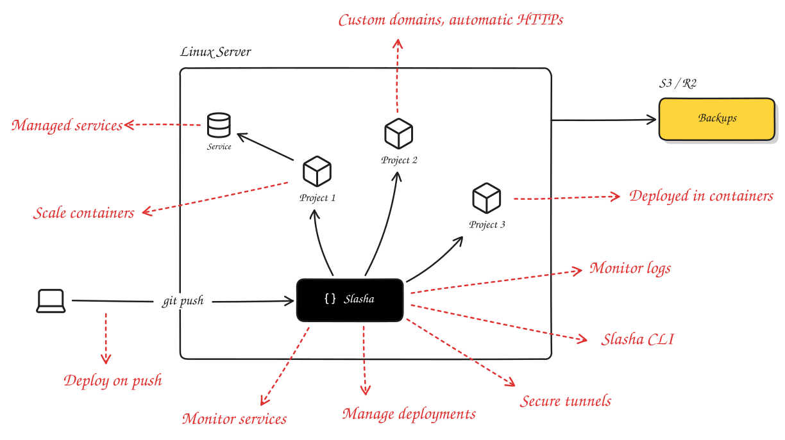

<br />

<p align="center">
  <picture>
    <source media="(prefers-color-scheme: dark)" srcset=".github/banner-dark.svg">
    <source media="(prefers-color-scheme: light)" srcset=".github/banner.svg">
    
  </picture>
</p>

<p align="center">
  Self-hosted platform to deploy your apps with a git push.
</p>

<p align="center">
  <a href="LICENSE"></a>
  <a href="https://slasha.com"></a>
  <a href="https://slasha.com/docs/getting-started/server-setup"></a>
  <a href="https://github.com/slashacom/slasha/actions"></a>
  
</p>
<br />

Slasha is a single binary you install on your server. It turns a plain Linux box into your own
platform-as-a-service: push code with git and Slasha builds it, runs it in a container, routes
traffic to it over HTTPS, and keeps it healthy - no Kubernetes, no YAML, no external control plane.

## Table of contents

- [Features](#features)
- [Requirements](#requirements)
- [Installation](#installation)
- [CLI usage](#cli-usage)
- [Development](#development)
- [Contributing](#contributing)
- [Security](#security)
- [License](#license)

## Features

- Deploy with a plain `git push`, with optional auto-deploy on every push
- Builds your code automatically with [railpack](https://railpack.com) — no Dockerfile required
- Run managed databases: PostgreSQL, MySQL, MongoDB, and Redis
- Automatic HTTPS on custom domains, with TLS issued and renewed for you
- Scale out by running more web or worker processes per app
- Zero-downtime deploys that are health-checked and auto-roll back on failure
- Stream live logs from any deployment or service
- Reach a managed service from your laptop through a secure tunnel, with no open ports
- Keep data on persistent volumes with on-demand and scheduled backups
- Manage apps, services, domains, and logs from the built-in web dashboard or the CLI

<br />




## Requirements

Slasha runs on the server. The setup script installs anything missing, but the host needs to be:

- A 64-bit Linux server
- Running `systemd`
- Reachable on ports `80` and `443` (and `22` for git over SSH)
- Run with root or `sudo`

The setup script installs and configures Docker (with Compose and Buildx), `ufw`, and `sshd` for you.
A domain you control, pointed at the server, is needed for HTTPS and the dashboard.

The CLI runs on your own machine (Linux, macOS, or Windows) and talks to your server over HTTPS.

## Installation

Run the setup script on a fresh server:

```bash
curl -fsSL https://slasha.com/setup.sh | bash
```

It prepares your server and asks for the domain where you want to reach the Slasha dashboard. From
there you can open the dashboard in your browser to set up projects, or do everything from the CLI.

Install CLI, on your local machine using:

```bash
curl -fsSL https://slasha.com/install.sh | bash
```

Then point it at your server and log in:

```bash
slasha set-url https://slasha.example.com
slasha login
```

For more details and step-by-step guidance, see the [documentation](https://slasha.com/docs/getting-started/server-setup).

## CLI usage

The `slasha` CLI manages everything the dashboard can. Commands that act on an app use the app linked
in the current directory (`slasha link` writes it to `.slasha`); pass `--app <slug>` to target another.
`--app` and `--server-url` are accepted anywhere on the command line, before or after the subcommand.

Setup and account:

```bash
slasha config set server-url https://paas.example.com
slasha auth login                # authenticate against your server
slasha auth status
slasha health                    # check the server is reachable
slasha ssh-keys add laptop --file ~/.ssh/id_ed25519.pub
```

Apps:

```bash
slasha apps create my-app
slasha link --app my-app         # link the cwd to an app (writes .slasha)
slasha apps list
slasha apps info
```

Deploying and logs:

```bash
git push slasha main             # deploy by pushing
slasha deploy                    # deploy the default branch's HEAD
slasha deploy --commit <sha> -f  # deploy a commit and follow its logs; exits non-zero if it fails
slasha logs                      # stored logs of the latest deployment, including failed ones
slasha logs <deployment-id> -f   # a deployment's stored logs, then live ones while it is active
slasha logs --search error -p web.0 -s stderr   # filter by text, process and stream
```

`slasha deploy`, `deployments redeploy` and `deployments rollback` print the exact `slasha logs`
command for the deployment they started.

Managing deployments:

```bash
slasha deployments list
slasha deployments redeploy [<id>]   # rebuild a deployment's commit; a running one is replaced without downtime
slasha deployments rollback [<id>]   # redeploy an earlier deployment's image (defaults to the previous one)
slasha deployments restart [<id>]    # restart the containers; keeps the environment they started with
slasha deployments stop [<id>]
slasha scale web=3 worker=1
```

Environment variables are read when a deployment starts, so a change reaches the running app with
the next deployment. `--deploy` (or `slasha env apply`) applies it straight away by starting a new
deployment from the running one's image, without a rebuild and with the usual readiness check:

```bash
slasha env list
slasha env set DATABASE_URL=... LOG_LEVEL=info   # applies on the next deployment
slasha env set LOG_LEVEL=debug --deploy          # ...or right away
slasha env unset LOG_LEVEL --deploy
slasha env apply                                 # apply saved changes to the running app
```

Release health checks: after a deploy starts your web process, Slasha probes it over HTTP and only
switches traffic once it responds. If it never becomes ready, the release is rolled back and the
previous deployment keeps serving. By default any HTTP response below 500 on `/` counts as ready,
within 60 seconds. Tune this per app from the Health Check section in the app settings, or with
two env vars:

```bash
slasha env set SLASHA_HEALTH_CHECK_PATH=/healthz   # probe this path; requires a 2xx/3xx response
slasha env set SLASHA_HEALTH_CHECK_TIMEOUT=120     # seconds to wait before failing the release
```

Managed services:

```bash
slasha services provision postgresql db --version 16
slasha services list
slasha services logs db -f
slasha services env db set POSTGRES_DB=app
slasha services backups db trigger
slasha services backups db download --file db.dump
slasha services proxy db --port 5432      # tunnel a remote service to localhost
```

Custom domains and nodes:

```bash
slasha domains add app.example.com
slasha domains list
slasha nodes list
slasha nodes console <node>
```

Run `slasha --help` (or `slasha <command> --help`) for the full list of commands and flags.

## Development

Slasha is a Rust workspace plus a React dashboard. To run it locally you need:

- [Rust](https://rustup.rs) (a nightly toolchain is used for formatting)
- [Bun](https://bun.sh) for the web dashboard
- Docker, for building and running deployed apps

Clone and run the server and dashboard together:

```bash
git clone https://github.com/slashacom/slasha.git
cd slasha
make dev            # copies .env.example to .env, then runs server + web
```

Other common tasks:

```bash
make dev-cli ARGS="status"    # run the CLI
make dev FEATURES="embed-web" # run dev server with custom cargo features
make docker-up                # run the full stack with docker compose
make format                   # cargo fmt (nightly) + biome
make lint                     # cargo clippy + biome
```

Configuration is read from `.env` (see `.env.example`):

| Variable                  | Description                                  | Example             |
| ------------------------- | -------------------------------------------- | ------------------- |
| `SLASHA_ENV`              | Runtime environment                          | `development`       |
| `SLASHA_PLATFORM_DOMAIN`  | Base domain for the dashboard and apps       | `slasha.localhost`  |
| `SLASHA_PORT`             | Port the server listens on                   | `3000`              |
| `SLASHA_JWT_SECRET`       | Secret used to sign auth tokens              | a long random value |
| `SLASHA_KEY`              | Secret used to encrypt credentials stored in the database    | a long random value |


## Contributing

Contributions are welcome. Fork the repository, create a branch, and open a pull request against
`main`. Before submitting, run `make format` and `make lint` so CI stays green. For larger changes,
please open an issue first to discuss the approach.

## Security

Slasha signs API tokens with `SLASHA_JWT_SECRET` (falling back to legacy `JWT_SECRET`), encrypts sensitive credentials stored in the database with `SLASHA_KEY`, and stores user passwords hashed with Argon2. Keep your
`.env`, `SLASHA_JWT_SECRET`, and `SLASHA_KEY` out of version control.

The setup script downloads and runs code from the network as root, review it before piping it to `bash` if you prefer. To report a security issue, please email security@slasha.com rather than opening a public issue.

## License

[MIT](LICENSE)
